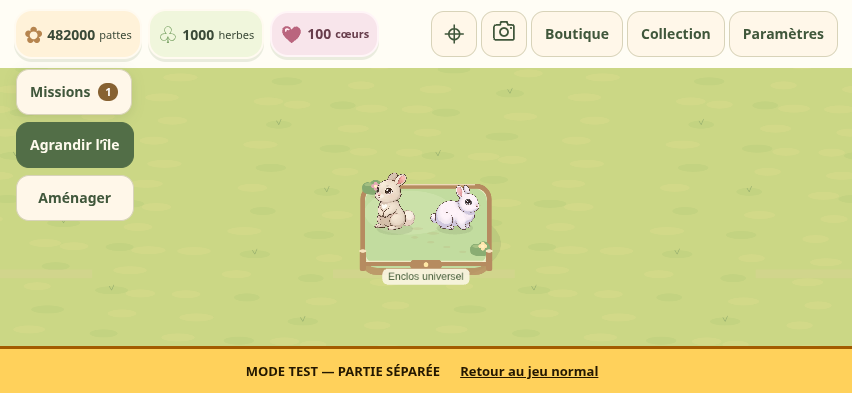
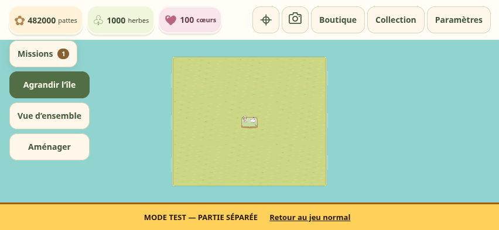
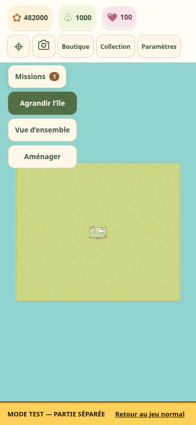

# Vue d’ensemble et dézoom

Depuis production `8bd2263` (application `687075e`). Aucun changement du format v7, des positions, empreintes, illustrations, ressources ou règles.

Le minimum de référence est **0,4**. La limite réelle prend la plus petite valeur entre 0,4 et le rapport entre l’espace utilisable à l’écran et les dimensions des neuf parcelles, augmentées de 80 unités d’eau de chaque côté. Une marge de 16 pixels protège le cadrage. Le HUD, le panneau ouvert et le bandeau du laboratoire sont pris en compte. Sur 852 × 393, le jeu normal peut atteindre environ **0,1964** ; le laboratoire environ **0,1649**. Sur 390 × 844, environ **0,2053**. La valeur dépend de l’écran et des panneaux visibles.

« Vue d’ensemble » cadre les parcelles acquises. L’ouverture d’Agrandir cadre les neuf parcelles potentielles, sans achat. « Recentrer » retrouve le point de départ et 1,05 ; maximum 1,65 conservé. Pincement et molette gardent leur point d’ancrage, avec limites continues lorsque la carte devient plus petite que l’écran. Une rotation d’écran pendant un geste attend la levée des doigts ; dézoomer ensuite ne force pas un saut vers un zoom supérieur.

Les noms de bâtiments disparaissent progressivement entre 0,85 et 0,55. Les bulles disparaissent entre 0,7 et 0,45, avec désactivation tactile lorsqu’elles sont trop effacées. Les portraits, panneaux et boutons restent à leur taille d’écran. Les silhouettes alpha des six lapins sont inchangées ; les autres zones de sélection rétrécissent avec le dézoom. Aucune reconstruction de terrain par image ni nouveau dessin d’eau : le fond existant de la caméra couvre le viewport.

## Validation

TypeScript, **627 tests / 20 fichiers** et builds normal/laboratoire réussis. Les nouveaux tests vérifient les six cadrages, la marge d’eau, les panneaux, l’ancrage du geste, la continuité des limites, le recentrage, l’orientation différée et l’absence de saut lors du dézoom après rotation.

Chromium tactile : centre, île partielle et île complète en paysage/portrait ; molette, pincement et panoramique réels ; Agrandir, Recentrer et retour rapproché ; 21 sélections des sept occupants à 0,4 / 0,8 / 1,65 ; placement fin et annulation sans dépense. Le contrôle des builds publics n’injecte aucun hook et ne modifie pas le stockage : il utilise les boutons réels, inspecte les sauvegardes et les pixels du fond. Les scripts source n’exposent leurs sondes que par interception de main.ts dans le test.

Le pilote WebGL Chromium de l’environnement tronquait les captures de page, bien que le canvas exporté soit complet. Les nouveaux contrôles emploient explicitement SwiftShader ; aucune modification du moteur ou des illustrations du jeu pour contourner ce défaut de capture. Aucun iPhone Safari physique n’est disponible ici.

[Rapport local public](validation/camera-overview/local-public-report.json) · [Rapport source](validation/camera-overview/local-source-report.json).

## Comparaison

Même scénario d’île complète : l’ancienne production à son minimum 0,8 puis la nouvelle vue d’ensemble. Le laboratoire garde son bandeau de partie séparée.

| Avant : minimum 0,8 | Après : vue d’ensemble |
|---|---|
|  |  |

## Essai iPhone

1. Toucher Vue d’ensemble en paysage puis en portrait ; pincer et déplacer la prairie.
2. Ouvrir Agrandir pour voir les neuf parcelles potentielles, puis fermer sans achat.
3. Recentrer, rapprocher le zoom et sélectionner un lapin ou essayer un placement puis annuler.

Les prévisualisations Décorations v5 et Comptes v4 sont publiées depuis leurs révisions figées. Comptes et Supabase restent en pause.

## Livraison

Application `c37966c10756dfe45bbfefae9e4ce63c446f599f`, [PR nº 9 fusionnée](https://github.com/sullivanlegoff-code/Project-L/pull/9). [CI complète réussie](https://github.com/sullivanlegoff-code/Project-L/actions/runs/38064379170) : 627 tests, TypeScript, deux builds, parcours tactiles et huit suites de builds réels avec 31 contrôles. L’arbre livré est exactement celui de la fusion testée. [Preuve durable CI](validation/camera-overview/ci.json).

[Publication réussie](https://github.com/sullivanlegoff-code/Project-L/actions/runs/38065148706) : les quatre révisions et formats réellement servis sont confirmés ; huit suites navigateur et 31 contrôles publics passent sans erreur. [Rapports durables](validation/camera-overview/publication.json) · [Captures publiques](https://github.com/sullivanlegoff-code/Project-L/actions/runs/38065148706/artifacts/11674952639).

[Jeu normal](https://sullivanlegoff-code.github.io/Project-L/) · [Laboratoire](https://sullivanlegoff-code.github.io/Project-L/dev/). Les six assets et paramètres de lapins restent inchangés ; les deux prévisualisations gardent leurs révisions v5 et v4.
